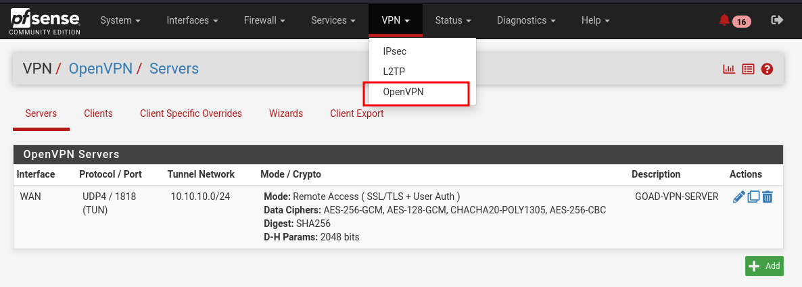
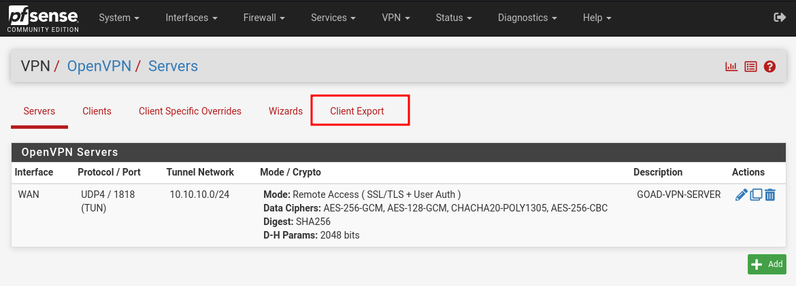
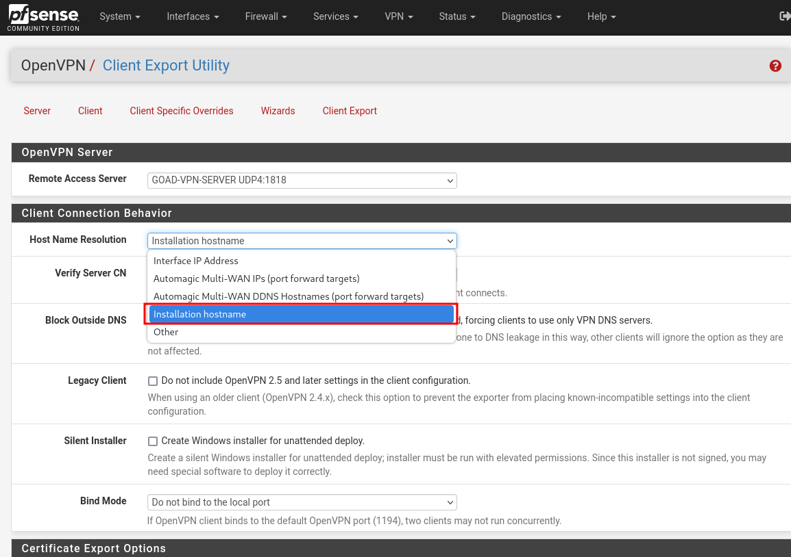
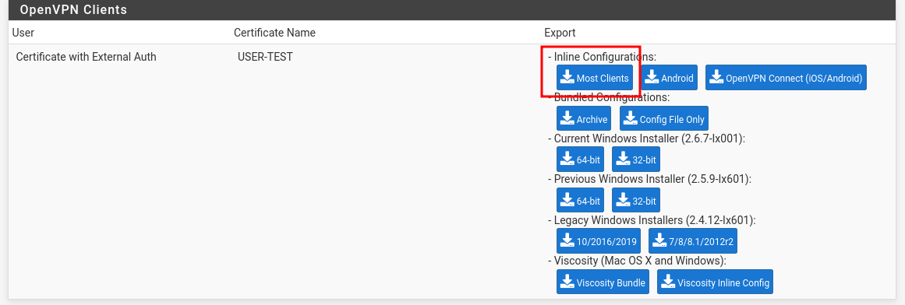
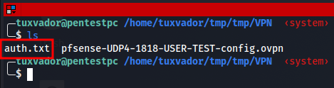
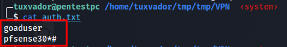
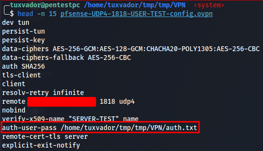
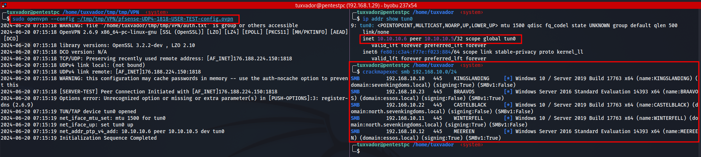

# PROXMOX GOAD AUTOINSTALL
Proxmox GOAD Pfsense Autoinstall

The aim of this repo is to share scripts that i have develloped to automate pfsense firewall install for proxmox

I am currently automating the majority of the tasks. For the install, the user only normaly has to modify the file **goad.conf** in the root directory of the repository.

The script will generate the **dev.tvars** file needed by terraform.

the install script will also : 
- install packages need for the install like sshpass and ansible
- create interfaces
- create terraform user, terraform role and terraform token and deletes them at the end of the install
- generate dev.tfvars for terraform
- modify ansibles inventory.yml to match goad.conf
- generate pfsense.sh to send keys based on the template pfsense.template.sh
- create and configure pfsense vm
- install and configure openvpn certificates and ca
- create the necessary pfsense rules and configure vlans
- configure openvpn server
- create and configure provisioning vm
- install necessary packages like ansible and terraform
- configure bpg/proxmox provider on provisionning with the correct information to create vms on proxmox
- download pfsense iso if not present
- download windows iso if not present
- check if templates are created and build them if not
- download virtio iso
- ... and much more

## Install.sh
path **install/install.sh**
to install pfsense in automatic mode, run : ```bash install/install.sh``` as root user on proxmox. 

This will generate the interfaces, install pfsense and configure it with the rules in ansibles playbook

No input is needed, the script uses and displays default value.

Yo can make the install interactive by editing DEFAULT_INSTALL to **N** in the config

once the install is done, log in to pfsense with the password **PFS_PWD** in goad.conf, you can change the password if needed



go to **VPN->OPENVPN** and clieck **client export**



selesct **installation hostname** in Hostname resolution and download config




once the download is done, put the file in the directory of your choice and create file auth.txt


in this file put the username and password on two seprate lines, the password for the goaduser is the same as for pfsense but you can change it in pfsense admin


open the ovpn file you download and edit the auth-pass directive and include the absolute path to auth.txt:


you are now ready to connect : 


use **install/destroy.sh** to delete all vms, you can edit the script if you want to keep particular vms

for the following commands to work, you need and active proxmox token, the token and user are deleted upon install so you may need to comment the last three lines in install.sh

some usefull commands :
```bash
terraform apply -var-file="files/dev.tfvars" -target=module.pfsense --auto-approve
terraform apply -var-file="files/dev.tfvars" -target=module.provisioning --auto-approve
terraform destroy -var-file="files/dev.tfvars" -target=module.pfsense --auto-approve
terraform destroy -var-file="files/dev.tfvars" -target=module.provisioning --auto-approve
tcpdump -i vmbr1 -e vlan
tcpdump -i vlan10 -e vlan
tcpdump -i vmbr0 port 1818
tcpdump -i vmbr0 udp
bash modules/provisioning/scripts/destroy.sh #to destroy all goad vms
```
*** 
Fill free to commit any issues met with the script with your setup or make a push commit to ameliorate the script, or if you notice any errors
***
```
PFSense version : pfSense-CE-2.7.2
Ansible version : core 2.14.3
Terraform version : v1.8.4
lxml version : 5.2.2
pfsensible.core version : 0.6.1
```

***
install time : 1h40 without iso downloads and template creation
***

Todo :
- TODO, download GOAD and make a local copy to provisionning and edit post install, to avoid repo being broken after repo modification
- Make the script be able to deploy other labs
- Automate ovpn download
- Check all variables that can be imported to the config
- Remove duplicates from config, maybe
- review firewall rules for vlan10 to disable internet acces after download
- Delete provisionning vm after install
- change goad user password in pfsense ansible playbook to make it interactive
- Run the script with iso download and template creation to determine the full install time depending on bandwith
- edit bash modules/provisioning/scripts/destroy.sh to automaticaly generate the node name
***

# Note
**Most important : when developing always use git, you won't regret it, i almost did**

You need internet access on your proxmox to install packages in pfsense.tf in /module/pfsense/ansible/scripts/pfsense.tf in the remote_exec block.

The lxml python package is needed to be able to edit xml files with ansible. It is not present by default in pfsense and needs to be copied or installed on another FreeBSD 14 instance and then moved to to the pfsense virtual machine
***
**Huge thanks to [mayfly277](https://mayfly277.github.io/categories/proxmox/) for his documentation on installing the GOAD LAB**
